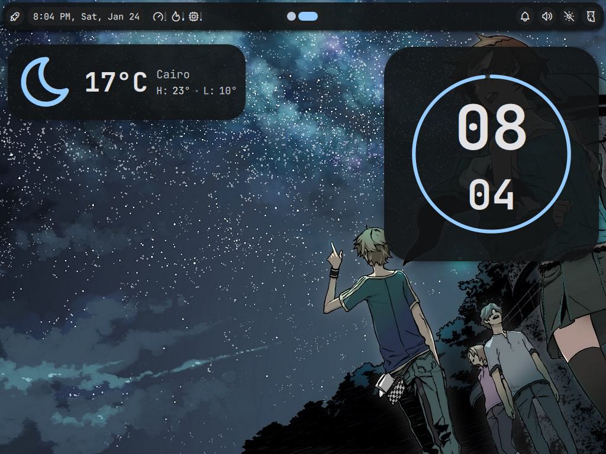

# NON-OS

NON-OS is my NixOS Configurations

(Switched to Sway, i3 files are deleted, and also removed pywal, access them by cloning then reverting to commit)

---

# Preview




---

# How To Use

- Clone this repo into your home directory

- Copy `/etc/nixos/hardware-configuration.nix` in `~/NixOS/non-os/`

- Rebuild NixOS using flakes (use your host name at the end
    
    ```bash
    sudo nixos-rebuild switch --flake ~/NixOS/non-os#host-name
    ```

    After this rebuild the command we just ran will be aliased into `nrs`

    
## Prerequisites

#### Fonts
- JetBrainsMono Nerd Font

#### Bar/WM
- Sway 
- Waybar

#### Terminal
- Foot 

#### Utilities
- btop
- grim
- slurp
- sway-contrib.grimshot 
- fish (Shell)
- Rofi (Application Launcher)

#### GTK
- Bibata Cursors
- ADW GTK3 powered by noctalia-shell templates so it'll follow the wallpaper colors

---

## Basic Keybinds

<kbd>Super + Return</kbd> -> Opens Foot 

<kbd>Super + Q</kbd> -> Closes Focused Application

<kbd>Super + D</kbd> -> Runs Rofi 

<kbd>PrtScr</kbd> / <kbd>Print</kbd> -> Takes a screenshot

---

## Future Plans

I am planning on disabling the noctalia shell templates, and use matugen

---

## Noctalia

you can either use waybar, and rofi or noctalia shell, noctalia shell is active by default

The default noctalia shell theme template is on, to turn it off, simply delete the lines that imports any external files, and uncomment the other lines
