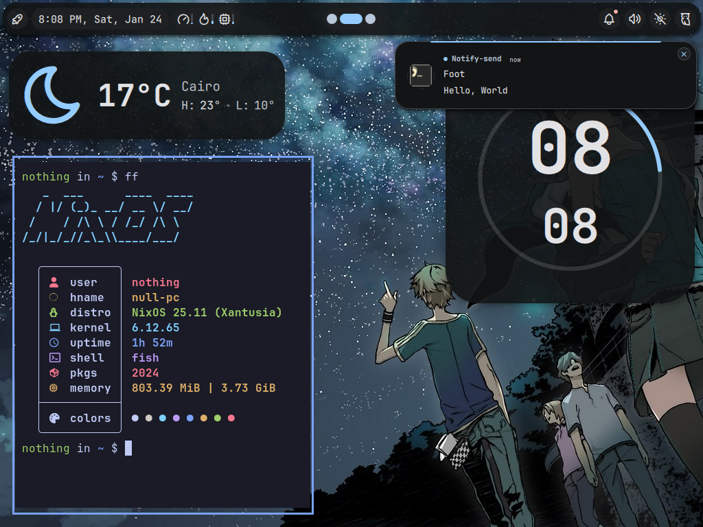
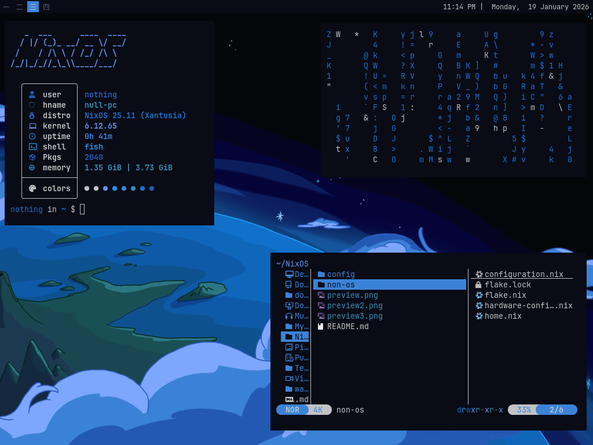

# NON-OS

NON-OS is my NixOS Configurations

---

# Preview






---

# How To Use

- Clone this repo into your home directory

- Copy `/etc/nixos/hardware-configuration.nix` in `~/NixOS/non-os/`

- Rebuild NixOS using flakes (use your host name at the end
    
    ```bash
    sudo nixos-rebuild switch --flake ~/NixOS/non-os#host-name
    ```

    After this rebuild the command we just ran will be aliased into `nrs`

    
## Prerequisites

I use these packages so make sure that you have it installed

#### Fonts
- JetBrainsMono Nerd Font

#### Bar/WM
- i3
- i3bar
- i3status

#### Terminal
- Alacritty

#### Utilities
- btop
- feh
- flameshot
- fish (Shell)
- dmenu (Application Launcher)

---

## Basic Keybinds

<kbd>Super + Return</kbd> -> Opens Alacritty

<kbd>Super + Q</kbd> -> Closes Focused Application

<kbd>Super + D</kbd> -> Runs dmenu

<kbd>PrtScr</kbd> / <kbd>Print</kbd> -> Takes a screenshot
